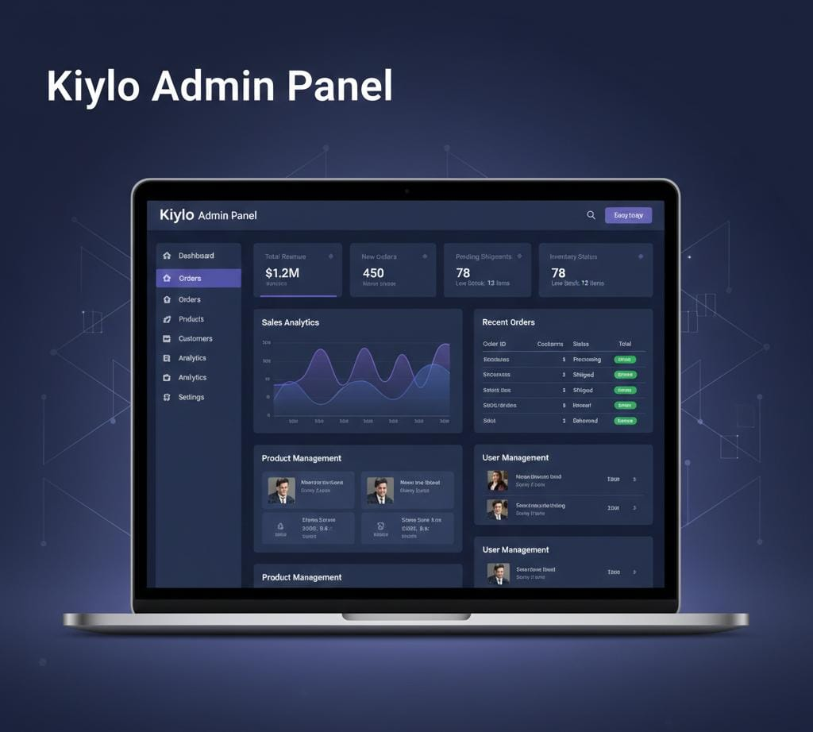

# 🛍️ Kiylo – Modern E-Commerce Platform

Kiylo is a full-stack e-commerce platform designed to deliver a smooth and modern shopping experience for customers while providing a powerful admin dashboard to manage and operate the system efficiently.

This project consists of a **React Native mobile app**, a **React + Tailwind CSS admin dashboard**, and a **Node.js + SQL backend API**.

---

## 📸 Project Preview

### 📱 Mobile App – Kiylo

### 🖥️ Admin Dashboard – Kiylo Admin

> 📌 *Images are for demonstration purposes. UI may vary during development.*

---

## 🚀 Project Overview

Kiylo enables users to browse products, add items to cart, place orders, and manage their profiles through a fast and user-friendly mobile application.  
Admins can manage products, categories, orders, users, inventory, and sales analytics through a secure web-based admin dashboard.

The system follows a scalable, API-driven architecture suitable for real-world e-commerce applications.

---

## 📱 Kiylo Mobile App (Kiylo-frontend)

**Technology:** React Native  

### Features
- User authentication (login & registration)
- Product browsing with categories
- Product search and filtering
- Add to cart & manage cart
- Secure checkout process
- Order history tracking
- User profile management
- Modern UI with smooth navigation

---

## 🖥️ Admin Dashboard (Kiylo-admin)

**Technology:** React + Tailwind CSS  

### Features
- Secure admin authentication
- Product & category management
- Order management and status tracking
- User management
- Inventory control
- Sales analytics & dashboard insights
- Responsive and modern UI

---

## ⚙️ Backend API (Kiylo-backend)

**Technology:** Node.js + SQL  

### Features
- RESTful API architecture
- User authentication & authorization
- Product, category, and order APIs
- Cart and checkout handling
- Admin operations support
- SQL database integration
- Secure and scalable backend structure

---

## 🛠️ Tech Stack

### Frontend (Mobile App)
- React Native
- Axios

### Admin Dashboard
- React
- Tailwind CSS
- Axios

### Backend
- Node.js
- Express.js
- SQL Database (MySQL / PostgreSQL)

---

## 📌 Future Enhancements

- Online payment gateway integration
- Push notifications
- Role-based admin access
- Product reviews and ratings
- Wishlist functionality

---

## 👨‍💻 Author

Developed by **Manuka Mayurajith**  
Full-Stack Developer | React | React Native | Node.js

---

## 📄 License

This project is for educational and portfolio purposes.

